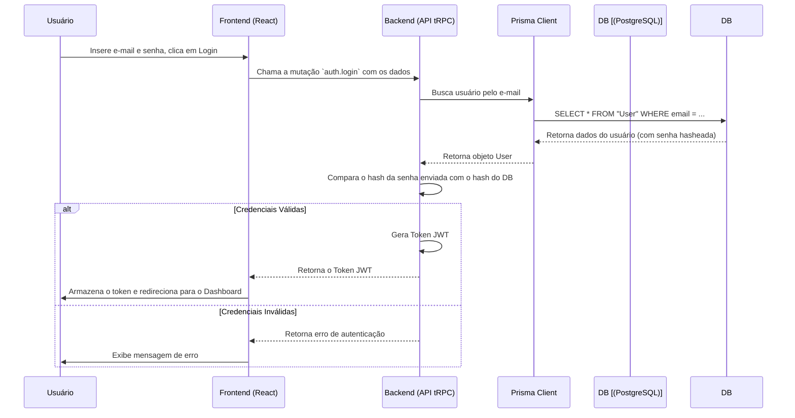
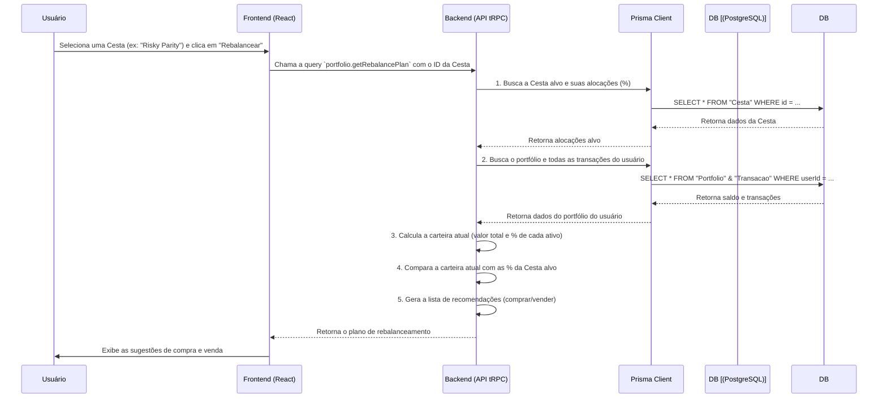

# Fluxos de Trabalho Principais (Core Workflows)

## Fluxo de Trabalho: Autenticação de Usuário

```mermaid
sequenceDiagram
    participant Usuário
    participant Frontend (React)
    participant Backend (API tRPC)
    participant Prisma Client
    participant DB [(PostgreSQL)]

    Usuário->>Frontend (React): Insere e-mail e senha, clica em Login
    Frontend (React)->>Backend (API tRPC): Chama a mutação `auth.login` com os dados
    Backend (API tRPC)->>Prisma Client: Busca usuário pelo e-mail
    Prisma Client->>DB: SELECT * FROM "User" WHERE email = ...
    DB-->>Prisma Client: Retorna dados do usuário (com senha hasheada)
    Prisma Client-->>Backend (API tRPC): Retorna objeto User
    Backend (API tRPC)->>Backend (API tRPC): Compara o hash da senha enviada com o hash do DB
    alt Credenciais Válidas
        Backend (API tRPC)->>Backend (API tRPC): Gera Token JWT
        Backend (API tRPC)-->>Frontend (React): Retorna o Token JWT
        Frontend (React)->>Usuário: Armazena o token e redireciona para o Dashboard
    else Credenciais Inválidas
        Backend (API tRPC)-->>Frontend (React): Retorna erro de autenticação
        Frontend (React)->>Usuário: Exibe mensagem de erro
    end
```

## Fluxo de Trabalho: Plano de Rebalanceamento

```mermaid
sequenceDiagram
    participant Usuário
    participant Frontend (React)
    participant Backend (API tRPC)
    participant Prisma Client
    participant DB [(PostgreSQL)]

    Usuário->>Frontend (React): Seleciona uma Cesta (ex: "Risky Parity") e clica em "Rebalancear"
    Frontend (React)->>Backend (API tRPC): Chama a query `portfolio.getRebalancePlan` com o ID da Cesta
    
    Backend (API tRPC)->>Prisma Client: 1. Busca a Cesta alvo e suas alocações (%)
    Prisma Client->>DB: SELECT * FROM "Cesta" WHERE id = ...
    DB-->>Prisma Client: Retorna dados da Cesta
    Prisma Client-->>Backend (API tRPC): Retorna alocações alvo
    
    Backend (API tRPC)->>Prisma Client: 2. Busca o portfólio e todas as transações do usuário
    Prisma Client->>DB: SELECT * FROM "Portfolio" & "Transacao" WHERE userId = ...
    DB-->>Prisma Client: Retorna saldo e transações
    Prisma Client-->>Backend (API tRPC): Retorna dados do portfólio do usuário
    
    Backend (API tRPC)->>Backend (API tRPC): 3. Calcula a carteira atual (valor total e % de cada ativo)
    Backend (API tRPC)->>Backend (API tRPC): 4. Compara a carteira atual com as % da Cesta alvo
    Backend (API tRPC)->>Backend (API tRPC): 5. Gera a lista de recomendações (comprar/vender)
    
    Backend (API tRPC)-->>Frontend (React): Retorna o plano de rebalanceamento
    Frontend (React)->>Usuário: Exibe as sugestões de compra e venda
```
